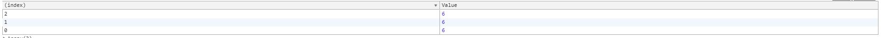

# ES6学习笔记
## 对比学习方法
解决一个问题分别使用ES5、ES6方式实现

### **常量**
ES5中的常量的写法 利用给对象增加属性的方法,JS中全局对象是window，对于常量来说可以绑定在window上
```
Object.defineProperty(window,"PI2", {
	value: 3.1415926,
	writable: false, //只读
}) 


console.log(window.PI2);

// ES6中常量的写法
const PI = 3.1415926;
console.log(PI);
```
### **作用域**

ES5中作用域
```
var callbacks = [];
for (var i = 0; i <= 2; i++) {
    callbacks[i] = function() {
        return i * 2;
    }
}
```
看下执行结果
```
console.table([
    callbacks[0](),
    callbacks[1](),
    callbacks[2](),
])
```
结果如下图所示

为什么都是6呢 这里其实是因为i的变量提升导致i的作用域其实是全局的
用let声明的变量有块级作用域 会将当前作用域下的j变量保存下来供后面的闭包使用
每循环一次就生成一个新的作用域，下面的闭包中的变量每次跟循环中的变量保持一致

块作用域
举个例子 在ES5中想给代码做个隔离————立即执行函数
```
(function() {
    var foo = function() {
        return 1;
    }
    console.log('foo()===1', foo() === 1);
    (function() {
        var foo = function() {
            return 2
        }
        console.log('foo()===2', foo() === 2);
    })()
})()
```
结果为true
原因是因为两个foo函数的作用域是不同的，作用域被立即执行函数隔离开

在ES6中就非常简单了两个{}之间的作用域是独立的
```
{
    function foo() {
        return 1;
    }
    console.log("foo()===1", foo() === 1) 
    {
        function foo() {
            return 2;
        }
        console.log("foo()===2", foo() === 2);
    }
    console.log("foo()===1", foo() === 1);
}
```
结果都是true 由此可见ES6中的作用域也更加简单利于理解

### **箭头函数**
ES6中函数的新的语法

ES5中：
```
function a() {

    }
```

ES6中：
```
()=>{
    
    }
```
这里要注意两点：
* 箭头函数中的小括号是用来声明参数的，当参数只有一个时可以省略小括号；
* 花括号中的表达式直接作为返回值时，花括号也可以被省略；
例如：
```
// ES5中
{
    var evens = [1,2,3,4,5];
    var odds = evens.map(function(v) {
        return v + 1;
    })
    console.log(evens,odds);
}
```
```
// ES6中
{
    let evens = [1,2,3,4,5];
    let odds = evens.map(v => v + 1);
    console.log(evens, odds);
}
```
ES5中的函数写法和ES6中的函数写法久经区别在哪里，答案就是关于this的绑定
```
//ES5中的写法
{
    var factory = function() {
        this.a = 'a';
        this.b = 'b';
        this.c = {
            a: 'a+',
            b: function() {
                return this.a
            }
        }
    }
    console.log(new factory().c.b());
};
```
输出结果是什么呢?答案是'a+'。
总结了一句话：this的指向是该函数被调用的对象
```
//ES6中的写法
{
    let factory = function() {
        this.a = 'a';
        this.b = 'b';
        this.c = {
            a: 'a+',
            b: ()=>{
                return this.a
            }
        }
    }
    console.log(new factory().c.b());
};
```
输出结果是'a'。为什么产生这样的差异呢？原因在于箭头函数函数体中的this的指向是定义时this的指向
